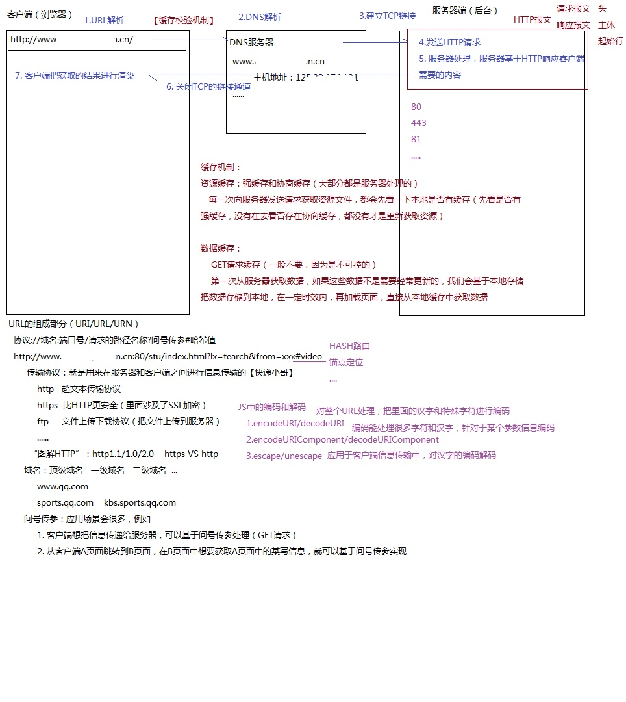
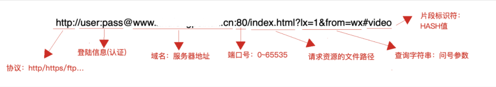
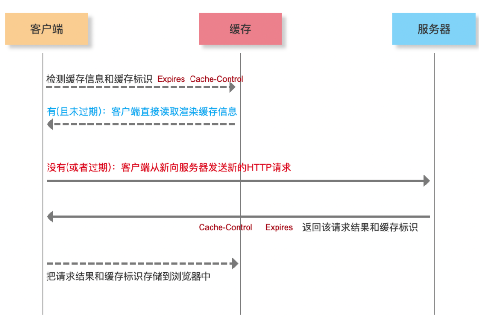
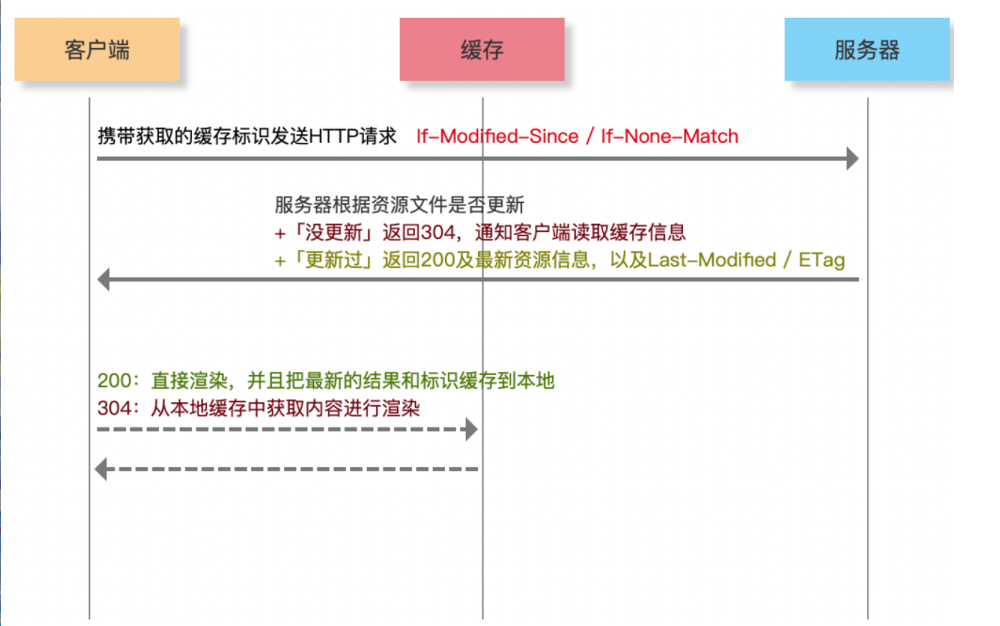
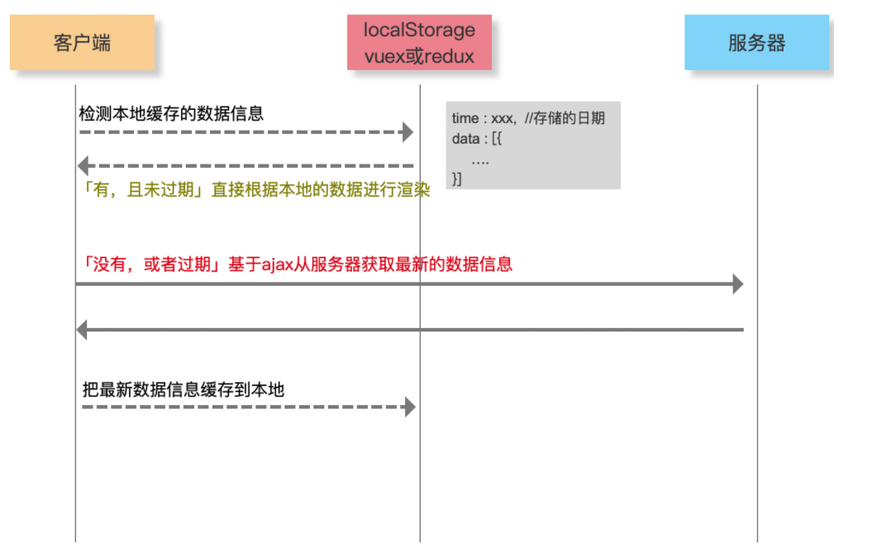
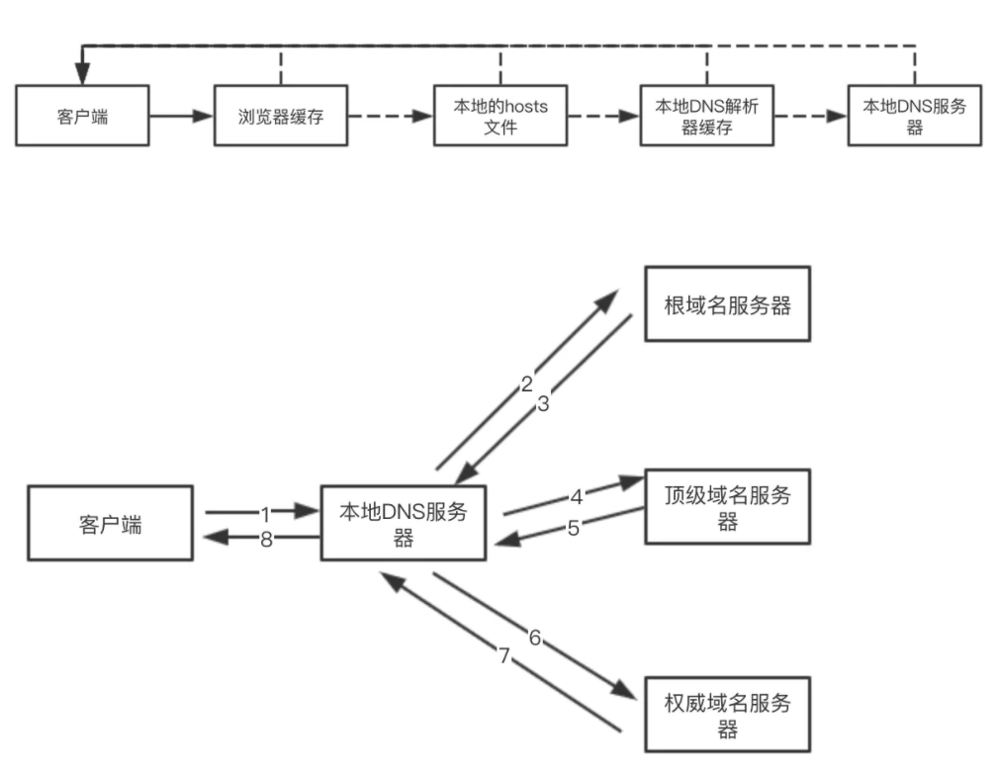
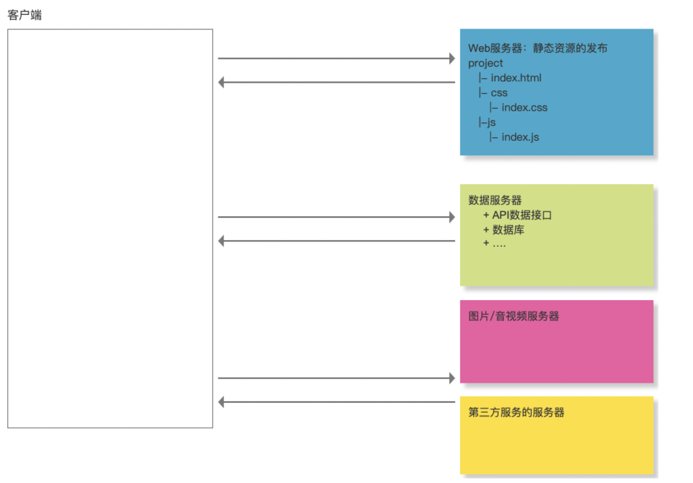
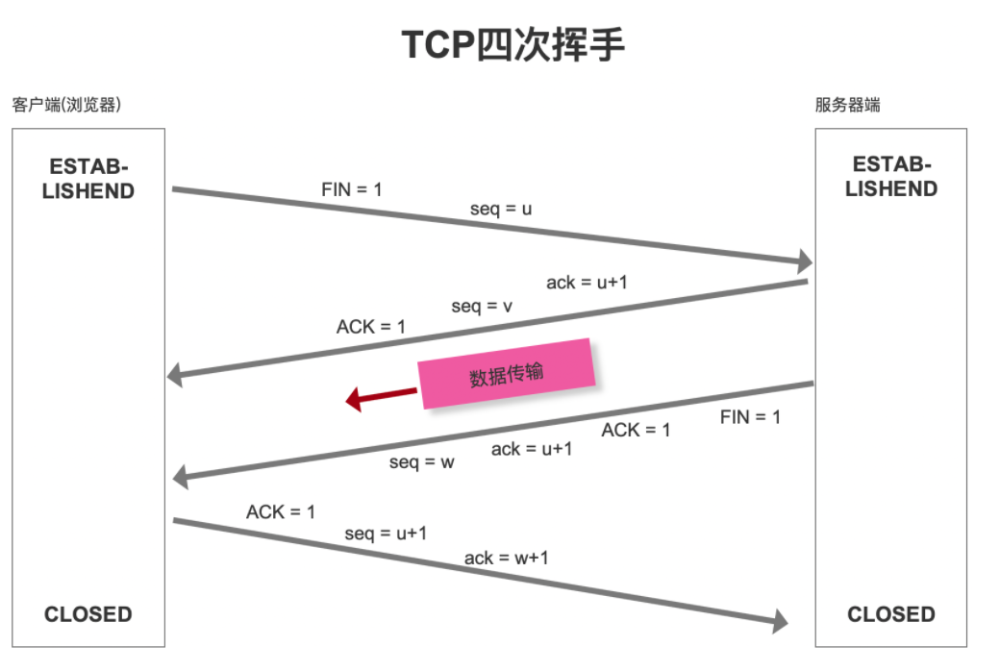

# 基于HTTP网络层的 “前端性能优化”
## 产品性能优化方案
- HTTP网络层优化
- 代码编译层优化 webpack
- 代码运行层优化 html/css + javascript + vue + react
- 安全优化 xss + csrf
- 数据埋点及性能监控
……
CRP（Critical Rendering Path）关键渲染路径

## 从输入URL地址到看到页面，中间都经历了啥
### 全过程概览
<!-- 
 -->

### 第一步：URL解析
- 地址解析
<!--  -->

- 编码

### 第二步：缓存检查
    缓存位置：
    Memory Cache : 内存缓存
    Disk Cache：硬盘缓存
打开网页：查找 disk cache 中是否有匹配，如有则使用，如没有则发送网络请求
普通刷新 (F5)：因TAB没关闭，因此memory cache是可用的，会被优先使用，其次才是disk cache
强制刷新 (Ctrl + F5)：浏览器不使用缓存，因此发送的请求头部均带有 Cache-control: no-cache，服务器直接返回 200 和最新内容

强缓存 Expires / Cache-Control
浏览器对于强缓存的处理：根据第一次请求资源时返回的响应头来确定的

- Expires：缓存过期时间，用来指定资源到期的时间（HTTP/1.0）

- Cache-Control：cache-control: max-age=2592000第一次拿到资源后的2592000秒内（30天），再次发送请求，读取缓存中的信息（HTTP/1.1）

- 两者同时存在的话，Cache-Control优先级高于Expires

<!--  -->

#### 协商缓存 Last-Modified / ETag
协商缓存就是强制缓存失效后，浏览器携带缓存标识向服务器发起请求，由服务器根据缓存标识决定是否使用缓存的过程
<!--  -->

#### 数据缓存
<!--  -->

### 第三步：DNS解析
- 递归查询
- 迭代查询
<!--  -->

每一次DNS解析时间预计在20~120毫秒
- 减少DNS请求次数
- DNS预获取（DNS Prefetch）

服务器拆分的优势

- 资源的合理利用
- 抗压能力加强
- 提高HTTP并发、
- ……
<!--  -->

### 第四步：TCP三次握手
为了准确无误地把数据送达目标处，TCP协议采用了三次握手策略。 
- 第一次握手：客户端给服务器发送一个SYN。客户端发送网络包，服务端收到了。服务器得出结论：客户端的发送能力，服务端的接收能力正常。
- 第二次握手：服务端收到SYN报文之后，会应答一个SYN+ACK报文。服务端发包，客户端收到了。客户端得出结论：服务端的接收和发送能力，客户端的接收和发送能力正常。但是此时服务端不能确认客户端的接收能力是否正常。
- 第三次握手;客户端收到SYN+ACK报文之后，回应一个ACK报文。客户端发包，服务端收到了。服务器得出结论：客户端的接收和发送能力，自己的接收发送能力都正常。
通过三次握手，双方都确认对方的接收以及发送能力正常。

- seq序号，用来标识从TCP源端向目的端发送的字节流，发起方发送数据时对此进行标记

- ack确认序号，只有ACK标志位为1时，确认序号字段才有效，ack=seq+1

- 标志位
  -  ACK：确认序号有效
  - RST：重置连接
  -  SYN：发起一个新连接
      - 同步序列编号（Synchronize Sequence Numbers）。是TCP/IP建立连接时使用的握手信号。
  - FIN：释放一个连接3
  - ……

#### ⭐三次握手为什么不用两次，或者四次?
TCP作为一种可靠传输控制协议，其核心思想：既要保证数据可靠传输，又要提高传输的效率！
<!--  -->

### 第五步：数据传输
- HTTP报文
    - 请求报文
    - 响应报文
- 响应状态码
  - 200 OK
  - 202 Accepted ：服务器已接受请求，但尚未处理（异步）
  - 204 No Content：服务器成功处理了请求，但不需要返回任何实体内容
  - 206 Partial Content：服务器已经成功处理了部分 GET 请求（断点续传 - Range/If-Range/Content-Range/Content-Type:”multipart/byteranges”/Content-Length….）
  - 301 Moved Permanently
  - 302 Move Temporarily
  - 304 Not Modified
  - 305 Use Proxy
  - 400 Bad Request : 请求参数有误
  - 401 Unauthorized：权限（Authorization）
  - 404 Not Found
  - 405 Method Not Allowed
  - 408 Request Timeout
  - 500 Internal Server Error
  - 503 Service Unavailable
  - 505 HTTP Version Not Supported
  - ……

### 第六步：TCP四次挥手
<!--  -->

#### ⭐为什么连接的时候是三次握手，关闭的时候却是四次握手？

服务器端收到客户端的SYN连接请求报文后，可以直接发送SYN+ACK报文

但关闭连接时，当服务器端收到FIN报文时，很可能并不会立即关闭链接，所以只能先回复一个ACK报文，告诉客户端：”你发的FIN报文我收到了”，只有等到服务器端所有的报文都发送完了，我才能发送FIN报文，因此不能一起发送，故需要四步握手。

#### Connection: keep-alive

### 第七步：页面渲染

## 🌟性能优化汇总

1.利用缓存
   + 对于静态资源文件实现强缓存和协商缓存（扩展：文件有更新，如何保证及时刷新？）  
   + 对于不经常更新的接口数据采用本地存储做数据缓存（扩展：cookie / localStorage / vuex|redux 区别？）

2.DNS优化
   + 分服务器部署，增加HTTP并发性（导致DNS解析变慢）
   + DNS Prefetch

3.TCP的三次握手和四次挥手
   + Connection:keep-alive

4.数据传输
   + 减少数据传输的大小
     + 内容或者数据压缩（webpack等）
     + 服务器端一定要开启GZIP压缩（一般能压缩60%左右）
     + 大批量数据分批次请求（例如：下拉刷新或者分页，保证首次加载请求数据少）
   + 减少HTTP请求的次数
     + 资源文件合并处理
     + 字体图标
     + 雪碧图 CSS-Sprit
     + 图片的BASE64
     + ......

5.CDN服务器“地域分布式”

6.采用HTTP2.0
 网络化是前端性能优化的中的重点内容，因为大部分的消耗都发生在网络层，尤其是第一次页面加载，如何减少等待时间很重要“减少白屏的效果和时间”
   + LOADDING 人性化体验
   + 骨架屏：客户端骨屏 + 服务器骨架屏
   + 图片延迟加载
   + ....
