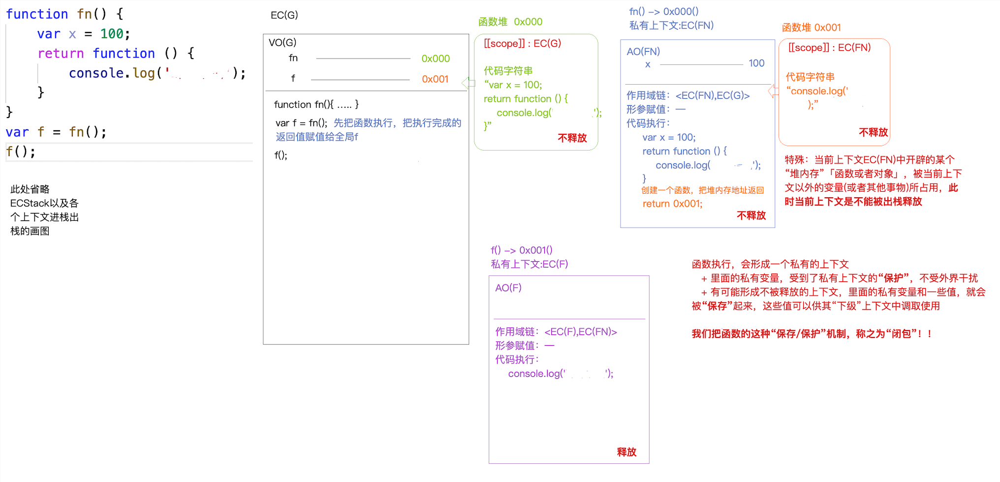

# 一些基础概念和底层机制

## JavaScript的底层运行机制

## 一些简写
- EC —— Execution Context：执行上下文
- ECstack 执行环境栈
- GC —— 垃圾回收
- VO —— Variable Object：储存当前上下文声明的变量
- AO —— Active Object：活动对象 （变量对象的一种，函数形成上下文叫做AO）
- GO —— Global Object：全局对象
- EC（FN）—— 私有上下文
- EC（G）全局执行上下文
- VO（G）全局变量对象 
- AO（G）
- scope:作用域，值是当前创建函数时候所处的上下文
- SCOPE-CHAIN:作用域链

## JS中的上下文(哪一个区域下执行的)
	-  全局上下文EC(G)
	- 函数执行会形成私有上下文
	- 块级私有上下文
	-  ....
	
## 私有变量和全局变量
- 私有变量：私有上下文声明的变量
	- 形参是私有变量
	- 代码执行时候声明的变量（eg.var/let/const/function）
- 全局变量：全局上下文声明的变量
- 私有和全局没有必然联系，可能有一些间接关系

## 堆栈内存
<!--  -->

## 关于函数和对象的堆栈问题
- 对象不能重复
- 堆和栈是分开的内存，在某个上下文中创建的堆，这样对应的堆和栈一定有关联（！！！但不是包含关系）
- 函数的堆内存：存的是函数的代码字符串
  对象的堆内存：存的是键值对
- 函数能否被出栈释放的条件：当前上下文的某个东西，一般是个堆内存（函数或对象），有没有被当前上下文以外的事物所占用，如果占用了，当前上下文就不能被释放；如果没有被释放，当前浏览器默认，执行了就出栈释放。

## 数据类型在浏览器底层的运行机制
1. 先创建值
	- 基本类型（直接存在栈内存中，直接按照值操作）
		- 栈内存：供代码执行 & 存储基本数据类型值
	- 引用类型（开辟一个单独内存空间（堆内存）用来存储信息）
2. 声明变量  declare
	- 存放到当前上下文的变量对象中（VO/AO)

3. 赋值操作（定义defined）—— 让变量和值关联到一起 


### 浏览器底层运行机制——基本类型


### 浏览器底层运行机制——引用数据类型


### 浏览器底层运行机制——全局对象


### 堆栈内存例子


## 函数执行步骤&垃圾回收机制
1. 形成一个私有的上下文(AO私有变量对象等也都有了:存储当前上下文中声明的变量)，然后进栈执行
2. 代码执行之前:
	+  初始化作用域链scope-chain
		// <当前自己的私有上下文，函数的作用域(创建函数时候所在的上下文)>  =>  链的右侧是当前上下文的“上级上下文”
    + 初始化 this
    + 初始化arguments
    + 形参赋值︰在当前上下文中声明一个形参变量，并且把传递的实参值赋值给它 
    + 变量提升
3. 代码执行
4. 出栈释放

<!--  -->

堆内存00：(2处，见图)，fn(y)中第一步执行的是将堆内存00中下标为0的12改为100

堆内存02：y = [100]


## 函数执行例子——闭包
<!--  -->
<!--  -->


## this的指向问题
[如何确定this的指向](https://juejin.cn/post/7010262564068130853)
### this函数的执行主体 
  + 函数执行主体：谁把函数执行的
  + 函数执行上下文：在哪执行的


### 规律
  1. 事件绑定:给当前元素的某个事件行为绑定方法，当事件触发、方法执行，方法中的this是当前元素本身
  2. 普通函数执行
    + 函数执行前面是否有“点”，没有“点”，this就是window（或者JS严格模式下是undefined）
    + 有“点”，“点”前面是谁this就是谁
    + 匿名函数(自执行函数/回调函数)如果没有经过特殊的处理，则this一般都是window/undefined，但是如果经过一些特殊处理，一切都以处理后的结果为主
    + 全局上下文中的this是window；块级上下文中没有自己的this，所用到的this都是所处上级上下文中的this;


### 一些举例

- 匿名函数
    ```js
    (function () {
        console.log(this); 
        //this->window/undefined
    })();
    ```
- 回调函数：（把一个函数作为实参值，传递给另外一个函数）
    ```js
    function fn(callback) {
        callback();
        //this->window/undefined    严格模式下是window
    }
    let obj = {
        // sum:function(){}
        sum() {
            console.log(this);
        }
    };
    // obj.sum(); //this->obj
    // 回调函数：把一个函数作为实参值，传递给另外一个函数
    // => fn(function () {});
    //
    fn(obj.sum);
        //obj.sum本身是一个函数，给它当作值传给一个函数
        //fn(obj.sum)相当于fn(function () {});
        //
        //相当于将fn(~)中的obj.sum当成实参传给了callback;
        //然后callback()执行
    ```
- 定时器就是经典的回调函数
    ```js
        setTimeout(function () { }, 1000);//将函数作为一个值传进定时器中，一秒钟之后将函数执行
    //
    setTimeout(function () {
        console.log(this);
        //window或者undefined     严格模式下是window
    }, 1000);
    ```
- 自己内部处理
    ```js
        let obj = {
        name: 'xxx'
    };
    let arr = [10, 20];
    arr.forEach(function (item, index) {        //依次遍历数组中的对象，数组中有两项，当前就将其循环两次
        console.log(this); //obj 因为触发回调函数执行的时候，forEach内部会把回调函数中的this改变为传递的第二个参数值obj “特殊处理”
    }, obj);
    ```
- 自定义函数:(function(){})();    //第一个括号包函数，第二个括号执行
    ```js
        let obj = {
        sum() {
            console.log(this);
        }
    };
    obj.sum(); //this->obj
    (obj.sum)(); //this->obj
    //
    // 括号表达式:小括号中包含“多项”(如果只有一项，和不加括号没啥本质区别)，其结果是只取最后一项；但是这样处理后，this会发生改变，变为window/undefined
    (10, obj.sum)();
    //this->window 
    (10.obj.sum) === obj.sum //->true
    ```
- 开启JS严格模式
    ```js
        // "use strict";
    function fn() {
        console.log(this);
        //创建函数没有被执行，鬼才知道this是谁
    }
    let obj = {
        name: 'yaya',
        fn: fn
    };
    fn(); //this->window/undefined
    obj.fn(); //this->obj 
    //
    document.body.onclick = function () {
        console.log(this); //body
    };
    document.body.addEventListener('click', function () {
        console.log(this); //body
    });
    //
    // IE6~8 DOM2事件绑定
    document.body.attachEvent('onclick', function () {
        console.log(this); //window
    });
    ```

- 全局上下文windows，块级上下文没有this
    ```js
        // 全局上下文中的this是window；块级上下文中没有自己的this，所用到的this都是所处上级上下文中的this;
    console.log(this); //window
    {
        let n = 12
        console.log(this);
        //window  上级上下文是全局上下文
    }
    ```
<!--
 * @Description: 
 * @Author: Lillian
 * @Date: 2022-03-15 17:57:35
 * @LastEditTime: 2022-03-15 17:58:05
 * Copyright (c) 2022 by Lillian, All Rights Reserved. 
-->