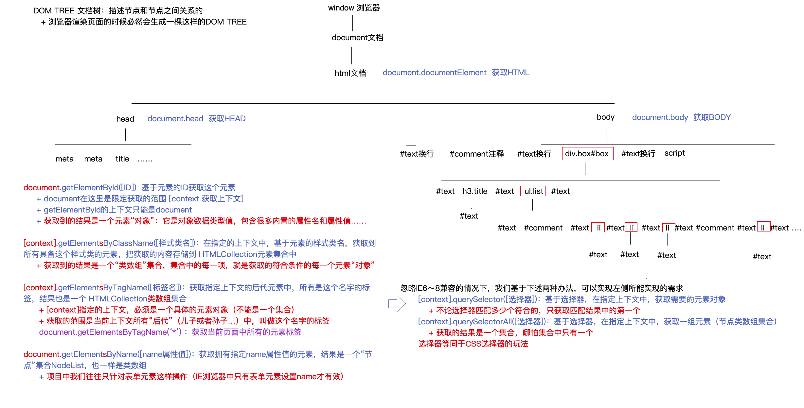

# DOM
## What
什么是DOM

​	文档对象模型（Document Object Model，简称DOM），是 [W3C](https://baike.baidu.com/item/W3C) 组织推荐的处理[可扩展标记语言](https://baike.baidu.com/item/%E5%8F%AF%E6%89%A9%E5%B1%95%E7%BD%AE%E6%A0%87%E8%AF%AD%E8%A8%80)（html或者xhtml）的标准[编程接口](https://baike.baidu.com/item/%E7%BC%96%E7%A8%8B%E6%8E%A5%E5%8F%A3)。
**一句话，提供一系列方法和属性，可以供我们操作页面元素。**
- 获取元素或其他节点
- 修改/获取元素的样式和内容
- 动态增加或者删除元素
- .......


​	W3C 已经定义了一系列的 DOM 接口，通过这些 DOM 接口可以改变网页的内容、结构和样式。

> DOM是W3C组织制定的一套处理 html和xml文档的规范，所有的浏览器都遵循了这套标准。

### DOM树
DOM TREE   文档树 ：描述节点和节点之间关系
- 浏览器渲染页面时必然会生成一棵这样的dom树
又称为文档树模型，把文档映射成树形结构，通过节点对象对其处理，处理的结果可以加入到当前的页面。

DOM树中概念
- 文档：一个页面就是一个文档，DOM中使用document表示
- 节点：网页中的所有内容，在文档树中都是节点（标签、属性、文本、注释等），使用node表示
- 标签节点：网页中的所有标签，通常称为元素节点，又简称为“元素”，使用element表示



## 获取元素
### Why
**基于JS实现“人机交互”（主要操作页面中的节点），核心处理第一步基本都是：想要操作谁就获取谁**
例如：我们想要操作页面上的某部分(显示/隐藏，动画)，需要先获取到该部分对应的元素，再对其进行操作。

### 如何获取页面元素
**DOM**在我们实际开发中**主要用来操作元素**。
我们如何来获取页面中的元素呢? 
获取页面中的元素可以使用以下几种方式: 
- 根据 ID 获取 
- 根据标签名获取 
- 通过 HTML5 新增的方法获取 
- 特殊元素获取


### ID-document.getElementById(id)
根据ID获取
- 语法：document.getElementById(id)
- document在这里限定获取的范围[context获取上下文]
- getElementById的上下文只能是document
- 作用：根据ID获取元素对象
- 参数：id值，区分大小写的字符串
- 返回值：元素"对象"(它是对象数据类型，包含很多内置的属性名和属性值...) 或 null
- 使用 console.dir() 可以打印获取的元素对象，更好的查看对象里面的属性和方法。

```js
<body>
    <div id="time">2021-9-9</div>

    <script>
        // 因为我们文档页面从上往下加载，所以先得有标签 所以我们script写到标签的下面
        var timer = document.getElementById('time');
        console.log(timer);
        console.log(typeof timer);
        // console.dir 打印返回的元素对象 更好的查看里面的属性和方法
        console.dir(timer); 	->'object'
		
		// attributes:NamedNodeMap集合，包含了其拥有的所有属性（内置属性id/class，以及自定义属性my-index）
    </script>
</body>
```

### 标签名-document.getElementsByTagName('标签名')
根据标签名获取元素
- 语法：document.getElementsByTagName('标签名') 或者 element.getElementsByTagName('标签名') 
- 作用：根据标签名获取元素对象 （返回带有指定标签名的对象的集合）
- 参数：标签名
- 返回值：元素对象集合（伪数组，数组元素是元素对象），获取不到时是空集合


注意：
1. 因为得到的是一个对象的集合，所以我们想要操作里面的元素就需要遍历。
2. getElementsByTagName()获取到是动态集合, 即：当页面增加了标签，这个集合中也就增加了元素。
3. dom 集合是类数组，有 length 有索引
4. context 不是指定的，当你想获取哪个元素的下的所有的指定标签，哪个元素就是 context
```js
<body>
    <ul>
        <li>小li</li>
        <li>小li</li>
        <li>小li</li>
        <li>小li</li>
        <li>小li</li>
    </ul>
    <ul id="nav">
        <li>123</li>
        <li>123</li>
        <li>123</li>
        <li>123</li>
        <li>123</li>
    </ul>
    <script>
        // 1.返回的是 获取过来元素对象的集合 以伪数组的形式存储的
        var lis = document.getElementsByTagName('li');
        console.log(lis);
        console.log(lis[0]);
        // 2. 想要依次打印里面的元素对象我们可以采取遍历的方式
        for (var i = 0; i < lis.length; i++) {
            console.log(lis[i]);
        }
        // 3. element.getElementsByTagName()  可以得到这个元素里面的某些标签
        var nav = document.getElementById('nav'); // 这个获得nav 元素
        var navLis = nav.getElementsByTagName('li');
        console.log(navLis);
    </script>
</body>
```

### class-document.getElementsByClassName() 
在上下文中，根据元素 class 名获取元素集合
- 参数：元素 class 名字
- 返回值：带有指定的 class 的元素集合，如果获取不到则返回空集合
- context: 想要在哪个元素下查找某些 class 类名的元素，哪个元素就是 context
```js
var someBox = document.getElementsByClassName('some-box');
console.log(someBox);
var child = parent.getElementsByClassName('child');
console.log(child);
```

### document.getElementsByName
通过 name 属性获取元素对象，一般用于表单元素集合
- 参数：元素 name 属性
- 返回值：带有指定那么属性值的元素集合，获取不到就是空集合