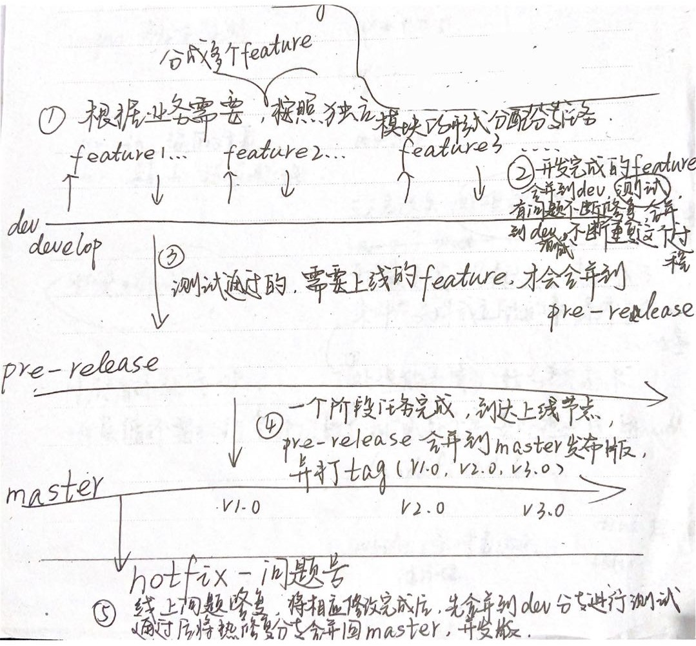

# git团队协作开发

## git开发流程图

## git在开发中的作用
1. 在工作目录中修改某些文件 
2. 对修改后的文件进行快照，然后保存到暂存区域 
3. 提交更新，将保存在暂存区域的文件快照永久转储到 git 目录中

## git开发流程
分支：大概三条主分支dev(develop开发分支)，pre-release(预发布分支)，master(发布分支)

1. 根据业务需求，将业务分成多个feature，按照独立模块的形式分配分支任务
2. 开发完成的feature合并到dev分支，测试，有问题不断修复，再次合并到dev，不断重复这个过程
3. 测试通过，需要上线的feature，才会合并到pre-release预发布分支
4. 一个阶段任务完成，到达上线节点，pre-release合并到master发布分支，并打上tag(v1.0, v1.1, v2.0, v3.0....)
5. hotfix -问题号，线上问题修复，将相应修改完成后，先合并到dev开发分支进行测试，测试通过后将热修复分支合并会master，并发布。

## 项目执行流程使用的命令：
git branch -a (查看所有分支)
0. 克隆代码 git clone 地址
1. 拉取线上 master 最新代码:  `git pull origin master` 
2. 切换到开发分支: `git checkout dev`
3. 合并master 本地分支（master）:  `git merge master` 
4. 开始开发
5. 开发结束
6. 查看当前文件更改状态: `git status`
7. 把所有更改代码放到缓存区: `git add -A`  
8. 查看当前文件更改状态 : `git status`
9. 缓存区内容添加到仓库中:  `git commit -m '本次更改注释'` 
10. 把代码传到 gitLab 上:  `git push origin dev`
11. 若代码到达上线标准则合并代码到 master,切换分支到 master:  `git checkout master` 
12. 拉取 master 最新分支:  `git pull origin master`
13. 合并分支代码到 master(若有冲突则解决冲突):  `git merge dev` 
14. 把当前代码上传到 gitLab:  `git push origin master`
15. 代码上线后，用 tag 标签标记发布结点(命名规则：prod_+版本_+上线日期) `git tag -a prod_V2.1.8_20200706`
16. tag 标签推到 gitLab `git push origin prod_V2.1.8_20200701`

### 暂存区命令
1. 需要合并别人代码进来
    - 把自己的代码放入暂存: git stash
    - 如果需要释放出来用: git stash pop#恢复最近一次的暂存
    - 查看有哪些队列: git stash list
    - 删除第一个队列，以此可以类推:  git stash drop stash@{0} 

2. 需要切换分支
    - git add -A
    - git stash save 'demo' 
    - git stash list
    - git stash apply stash@{0}

### 补充指令
- `git reflog` 查看提交记录命令：
- `git show` # 显示某次提交的内容 
- `git show $id git rm <file>` # 从版本库中删除文件
- `git reset <file>` # 从暂存区恢复到工作文件
- `git reset HEAD^` # 恢复最近一次提交过的状态，即放弃上次提交后的所有本次修改 
- `git diff <file>` # 比较当前文件和暂存区文件差异 git diff
- `git log -p <file>` # 查看每次详细修改内容的 diff 
- `git branch -r` # 查看远程分支
- `git merge <branch>` # 将 branch 分支合并到当前分支
- `git stash pop git pull` # 抓取远程仓库所有分支更新并合并到本地
- `git push origin master` # 将本地主分支推到远程主分支
- `git branch 分支名`#创建分支
- `git checkout 分支名`#切换分支
- `git checkout -b 分支名`#创建并切换分支
- `git branch --merge / git branch --no-merge`#查看已经合并的分支/未合并的分支
- `git branch -d 分支名 / git branch -D` 分支名#删除的已合并的分支/未合并的分支